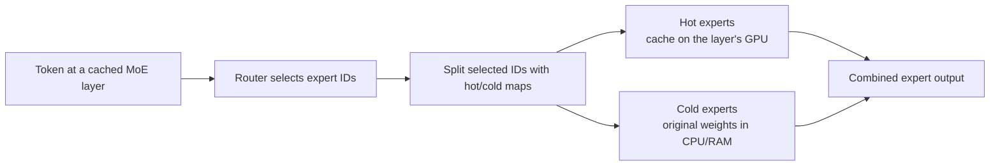

# Pascal Frankenstein LLM

A personal local-LLM inference and hardware-adaptation project for my old rig:
Intel i7-4790K with a GTX 1080 Ti (11 GB) and a GTX 1070 (8 GB).
The aim is practical, reproducible inference—not a new inference engine.

The work starts from [llama.cpp](https://github.com/ggml-org/llama.cpp) and,
for the MoE experiments, from the `perf` branch of
[thecodacus/llama.cpp](https://github.com/thecodacus/llama.cpp), initially at
branch `perf`, commit `d927e7dc1`. This file documents what was needed to make that fork useful on
two unequal Pascal GPUs with no CUDA peer-to-peer access.

## Scope and disclosure

This repository is a record of local integration, code adaptation, measurement,
and debugging. It does **not** claim authorship of llama.cpp, GGML, the MoE
expert-cache design, or multi-GPU inference in general. I want to thank
Salvatore Sanfilippo aka `antirez` for his great passion, `thecodacus` and all
the contributors of open source community.
We are living in an amazing time, and with the help of AI I hope the world
will be a better place.

`thecodacus` created the `perf`-branch MoE work: routing traces, hot/cold
expert caching, CPU/GPU overlap, and its speculative-decoding path. The local
change described here places each hot-expert cache pack on the GPU that owns
the corresponding model layers and adds independent cache-slot counts per GPU.

The experiments, implementation, and documentation were developed with
substantial assistance from ChatGPT/Codex. The human operator set the hardware
constraints, selected the experiments, ran and validated them, and decided
which results were retained.

## Development hardware and constraints

| Component | Configuration |
| --- | --- |
| Host hardware | Intel i7-4790K (AVX2), 32 GB DDR3 |
| Development environment | Ubuntu 24.04.1 under WSL2; 24 GB RAM + 4 GB swap allocated to WSL |
| CUDA0 | GTX 1080 Ti, 11 GB, Pascal `sm_61` |
| CUDA1 | GTX 1070, 8 GB, Pascal `sm_61` |
| CUDA / driver | CUDA Toolkit 12.9, Windows driver 581.80 |

Pascal is not supported as a compilation target by CUDA 13, so the build stays
on CUDA 12.9. CUDA Graphs being disabled on this architecture is expected.

WSL2 is the development environment, not a hardware property. Its memory limit
was raised from 15 GB to 24 GB because the mmap-backed model and MoE expert
weights need enough Linux page cache. At 15 GB, page-cache thrashing dominated
the early MoE measurements; the full before/after record and `.wslconfig`
setting are in `doc/BASELINE_LOG.md`.

The NVIDIA Control Panel power mode must be **Prefer maximum performance**.
Without it, decode can fall to P5 clocks and invalidate measurements.

## What works today

### Dense chat and coding: Qwen3.8-27B

The conservative daily-use profile is Qwen3.8-27B Q4_K_M, 16k context, one
server slot, full GPU offload, automatic layer split, F16 KV cache, and Flash
Attention. It is a performance baseline, not the target of the dual-GPU MoE
adaptation.

| Test | Allocated context | Prompt / prefill | Generation | Repetitions | Result |
| --- | ---: | ---: | ---: | ---: | --- |
| `llama-bench` synthetic `pp512` / `tg128` | synthetic | **176.15 ± 4.52 t/s** | **10.31 ± 0.60 t/s** | 3 | baseline benchmark |
| `llama-server` coding request | 16k | **89.02 t/s** | **10.37 t/s** | 1 | correct response |

```bash
cd $HOME/pascal-frankenstein-llm
./llama.cpp/build-pascal-cuda/bin/llama-server \
  -m /mnt/e/lmstudio-models/lmstudio-community/Qwen3.8-27B-GGUF/Qwen3.8-27B-Q4_K_M.gguf \
  -c 16384 --parallel 1 -ngl 999 \
  -ctk f16 -ctv f16 -fa on \
  --host 127.0.0.1 --port 18080 --jinja --no-webui
```

A 32k configuration could be made to fit only with impractical performance, so
16k is the recommended working context.

### MoE performance experiment: Qwen3.6-35B-A3B MTP

The fastest tested MoE profile uses the official Unsloth
Qwen3.6-35B-A3B-MTP-UD Q4_K_M GGUF, `-ncmoe 33`, an asymmetric cache of
`160,108`, and MTP with `n-max=2`.

| Model / workload | Context | Cache / MTP | Prompt / prefill | Generation | Repetitions | Status |
| --- | ---: | --- | ---: | ---: | ---: | --- |
| MTP-UD, short 128-token prompt | 64k capacity | `160,108`, MTP `n-max=2` | — | **30.13 ± 0.49 t/s** | 3 | operational benchmark |
| MTP-UD, 60,132 real prompt tokens | 64k | `160,108`, MTP `n-max=2`, F16 KV | **132.8 t/s** | **25.5 t/s** | 1 | capacity and throughput check |
| Heretic, short smoke test | 64k capacity | `160,108`, no MTP | **44.2 t/s** | **19.1 t/s** | 1 | not a baseline |

These are local measurements, not portable claims about llama.cpp or the
upstream fork. The 60,132-token run verifies that the configuration can fill
most of a 64k context and remain operational at the reported throughput; it
does not yet validate retrieval, reasoning, or answer quality at that length.
The HTTP version of the current 64k profile still needs a replicated benchmark.

### Native Linux Mint follow-up

The next experiment branch is `native-linux-mtp-tests`. The current operational
candidate uses the release binary on native Linux Mint and the
`Qwen3.6-35B-A3B-uncensored-heretic-Native-MTP-Preserved-Q4_K_M.gguf` model,
with the exact command recorded in [`doc/BASELINE_LOG.md`](doc/BASELINE_LOG.md).
Throughput, MTP acceptance, model hash, and output correctness still need to be
recorded before this becomes a baseline.

The first native Linux 128k capacity test is now complete: 120,021 effective
prompt tokens were processed without OOM or context truncation at 153.77 t/s,
followed by MTP generation at 23.62 t/s with 72.8% acceptance. The test used
Q8 K/V, one server slot, and `--reasoning-preserve`; its 128-token output limit
was consumed by reasoning, so it is a capacity result rather than a complete
agent-quality result.

A controlled short-prompt comparison on the Heretic MTP-preserved model measured
46.13 t/s with F16 K/V and 45.24 t/s with Q8 K/V, both with MTP enabled. This
shows that the lower 120k result is primarily a long-context workload result,
not evidence that MTP is unavailable or broken. Unsloth's UD files are separate
dynamic-quantization artifacts; the local Heretic file preserves native MTP but
is not an Unsloth UD quantization.

### Portable local installation

Release archives include the CUDA binaries, matching MoE profiles, and portable
helper scripts. GGUF weights remain external. After extracting an archive:

Maintainers can package an existing build outside the repository by setting
`FORK_SOURCE_ROOT` to the corresponding llama.cpp checkout before running
`scripts/package-linux-release.sh`.

```bash
./scripts/install-local.sh .
${EDITOR:-vi} ~/.config/pascal-frankenstein-llm/qwen.env
pascal-verify-install.sh
pascal-run-qwen.sh 64k
```

The launcher sets `LD_LIBRARY_PATH` itself and supports `64k`, `128k`, and
`remote` modes. The configuration contains only local paths and is preserved
when the same installation directory is upgraded. Models can be downloaded
with an optional pinned revision and SHA-256 check:

```bash
pascal-download-model.sh ORG/REPO model-q4.gguf /models/model-q4.gguf main SHA256
```

The release also includes a dependency-light installer smoke test. It uses
stub executables and never downloads a model:

```bash
./scripts/test-installer.sh
```

This test is suitable for a clean Ubuntu/Mint host or a container. It does not
replace native-GPU validation; CUDA execution and throughput remain host tests.

A preliminary remote test over Tailscale reached 48.61 t/s generation with
73.1% MTP acceptance, while a Firefox request on the host reached 32.30 t/s
with 66.4% acceptance. The requests had different prompt and output lengths,
so these are observations rather than a controlled client comparison; the
remote path itself did not show an obvious throughput penalty.

```bash
cd $HOME/pascal-frankenstein-llm
./llama.cpp/build-pascal-cuda/bin/llama-cli \
  -m $HOME/llm-models/pascal-tests/Qwen3.6-35B-A3B-MTP-UD-Q4_K_M.gguf \
  -c 65536 -ngl 99 -ncmoe 33 -ts 10,7 -fa on \
  -ctk f16 -ctv f16 -b 512 -ub 512 \
  --moe-cache-profile $HOME/pascal-frankenstein-llm/moe-traces/qwen36-35b-mtp-merged.csv \
  --moe-cache-slots 160,108 \
  --spec-type draft-mtp --spec-draft-n-max 2 \
  --reasoning off --temp 0 --seed 123
```

The 20 GB Heretic GGUF does not expose a compatible MTP context. Its single
smoke test is included for completeness, not as a recommended baseline.

## The local MoE cache adaptation

The upstream fork uses a routing profile to keep frequently selected (“hot”)
experts in GPU memory while “cold” experts remain available in system RAM. On
this machine the original allocation chose the first GPU for every hot cache
pack. That left CUDA1 executing its layer group without the corresponding hot
experts and wasted its available VRAM.

The local change in `src/llama-model.cpp`,
`llama_model_base::init_moe_expert_cache()`, makes the cache follow the device
already selected for each layer (`dev_layer[il]`). It also accepts a separate
slot quota per device: `--moe-cache-slots 160,108` means 160 hot experts per
cached CUDA0 layer and 108 per cached CUDA1 layer. It does not change routing,
expert weights, or the cold-expert fallback.

For each cached MoE layer, the router can select a mixture of hot and cold
experts. The fork separates those expert IDs, evaluates the two paths, and
combines their outputs:



The operational `-ncmoe 33` profile does not cache all 40 layers. Its physical
placement is:

| Device | Model-layer ownership | Expert residency |
| --- | --- | --- |
| CPU / RAM | Cold path for cached layers 0–32 | Original expert weights for layers 0–32 |
| CUDA0 · GTX 1080 Ti | Layers 0–24 | Hot cache, 160 slots per cached layer |
| CUDA1 · GTX 1070 | Layers 25–39 | Hot cache, 108 slots per layer for 25–32; all experts resident for 33–39 |

Before the local change, every hot cache pack was allocated on CUDA0, including
packs for cached layers owned by CUDA1. On a system without CUDA P2P, that
placement left CUDA1 without a local hot cache for its layer group. The local
change preserves the layer-to-device assignment and places each cache pack on
that same device.

The first distributed-cache test established correct placement rather than a
meaningful speedup: it showed cache packs and VRAM use on both GPUs. The useful
result came from combining this placement with hybrid expert residency,
asymmetric cache sizes, and the MTP model. All intermediate measurements,
including failed configurations, are retained in the experiment log.

## MoE glossary

| Term | Meaning in this project |
| --- | --- |
| **MoE** | Mixture of Experts: the router selects only a small subset of expert networks for each token. |
| **A3B** | About 3 billion active parameters per token; it does not mean the complete 35B model occupies 3B parameters of memory. |
| **Expert** | One routed feed-forward subnetwork. “Hot” and “cold” describe where that expert is served from for a given cache profile, not an intrinsic expert property. |
| **Routing profile** | A CSV produced by `llama-moe-trace` that counts routed expert IDs per layer over representative workloads. |
| **Hot-expert cache** | A GPU copy of the frequently routed experts selected by the profile. Original expert weights remain available in CPU/RAM for cold requests. |
| **`-ncmoe N`** | Keeps original experts for the first `N` MoE layers in CPU/RAM; later MoE layers keep all their experts in GPU memory. |
| **MTP** | Multi-Token Prediction: the model proposes multiple future tokens, then verifies them with the main model. It can improve decode speed only when acceptance repays its overhead. |
| **`mmproj`** | Multimodal projector: a separate GGUF vision encoder that turns an input image into embeddings the main text model can attend to, enabling image understanding. It is specific to the model family it ships with; projectors from different repositories are not interchangeable even when similarly named. |
| **`pp512` / `tg128`** | Synthetic `llama-bench` prefill of 512 tokens / generation of 128 tokens. They are not equivalent to a real chat request. |
| **`r=1` / `r=3`** | One repetition is screening only; three is the normal minimum for a reported baseline. |

### Build used for the measurements

```bash
cd $HOME/pascal-frankenstein-llm/llama.cpp
cmake -S . -B build-pascal-cuda -G Ninja \
  -DGGML_CUDA=ON \
  -DCMAKE_CUDA_COMPILER=/usr/local/cuda-12.9/bin/nvcc \
  -DCMAKE_CUDA_ARCHITECTURES=61 \
  -DGGML_NATIVE=ON \
  -DLLAMA_BUILD_TESTS=OFF
cmake --build build-pascal-cuda -j 4
```

`llama-cli` and `llama-server` use comma-separated tensor splits (`-ts 10,7`).
In this fork's `llama-bench`, a slash keeps it a single configuration
(`-ts 10/7`); using a comma starts two separate benchmark configurations.

## Measurement rules and open work

- Change one variable at a time. Use `r=1` only for screening and at least
  `r=3` for a baseline.
- Record model hash, fork commit, context actually populated, K/V type, batch,
  cache/MTP settings, RAM/swap, and VRAM per GPU.
- Do not include model-load time from `/mnt/e` in inference throughput.
- Host registration (`cudaHostRegister`) is unsupported by the current WSL
  CUDA path. Keep host registration and prefetch off in WSL; test that pair on
  native Linux only.
- Next work: objective quality and long-context evaluation, a replicated 64k
  HTTP MoE run, then a measured 128k candidate. No performance gain is assumed
  before measurement.

## Repository map

| Path | Purpose |
| --- | --- |
| [`llama.cpp/`](llama.cpp/) | Git submodule pinned to the local `pascal-dual-gpu-cache` fork commit. |
| [`doc/`](doc/) | Project documentation: experiment log, benchmarks, model operations guide, release notes. |
| [doc/BASELINE_LOG.md](doc/BASELINE_LOG.md) | Complete chronological experiment record, commands, parameters, failures, and measurements. Historical notes are retained in Italian. |
| [doc/BENCHMARKS_AND_QUALITY.md](doc/BENCHMARKS_AND_QUALITY.md) | Quality and long-context validation protocol. |
| [doc/MODEL_LOCAL_GUIDE.md](doc/MODEL_LOCAL_GUIDE.md) | Operational guide for Qwen 35B-class models: local serving, 128k context, Tailscale, Open WebUI, Pi, and planned tests. |
| [doc/RELEASE_NOTES_v0.2.0.md](doc/RELEASE_NOTES_v0.2.0.md) | Candidate release scope and installation validation for the portable workflow. |
| [`config/`](config/) | Example user configuration for the portable release launcher. |
| [`scripts/`](scripts/) | Release packaging, installation, verification, download, and launch helpers. |
| [`moe-traces/`](moe-traces/) | The two consolidated v1 routing profiles used by the documented experiments. |
| [AGENTS.md](AGENTS.md) | Local instructions for coding agents; not end-user documentation. |
| [LICENSE](LICENSE) | MIT license for this repository; the submodule retains its upstream license. |

## Upstream work

- [llama.cpp / GGML](https://github.com/ggml-org/llama.cpp): inference engine,
  GGUF ecosystem, kernels, and multi-GPU support.
- [thecodacus/llama.cpp](https://github.com/thecodacus/llama.cpp): `perf`
  branch used as the MoE-cache baseline.
- [antirez/ds4](https://github.com/antirez/ds4) and
  [Ninnix/q36](https://github.com/Ninnix/q36): studied as reference projects;
  they are not part of this project or its build.

## License and model files

This repository does not distribute model weights. Model files remain outside
the repository. The modified llama.cpp fork retains its upstream license and
attribution requirements; publish the local fork changes with the original
license intact.

## Prebuilt Linux release

The first manually built pre-release is
[`v0.1.0-pascal-cuda12-sm61`](https://github.com/dinolupo/pascal-frankenstein-llm/releases/tag/v0.1.0-pascal-cuda12-sm61).
Its assets were built from `dinolupo/llama.cpp` at the submodule commit pinned
by this repository: `b00c2d77e` (`pascal-dual-gpu-cache`), based on
`thecodacus/llama.cpp` `perf` at `d927e7dc1`. In other words, the binary
contains the local per-device cache changes; the upstream fork is its base,
not the exact source tree being released.

The release archive is:

```text
pascal-frankenstein-llm-v0.1.0-linux-x86_64-cuda12-sm61.tar.gz
```

It contains `llama-cli`, `llama-server`, `llama-bench`, `llama-moe-trace`,
their required project shared libraries, build metadata, and `SHA256SUMS`. It
does not contain GGUF model weights or NVIDIA libraries. Download the archive
and its `.sha256` sidecar from the release page, then verify it before
extraction:

```bash
sha256sum -c \
  pascal-frankenstein-llm-v0.1.0-linux-x86_64-cuda12-sm61.tar.gz.sha256
```

The upstream build-version string printed by `--version` can still report
`10125 (d927e7dc1)`. Consult `BUILD_INFO.txt` inside the release asset for the
exact fork commit that produced the binaries.

The release is for Linux x86_64 with a compatible NVIDIA driver, CUDA 12 runtime
libraries, and a Pascal `sm_61` GPU. After extraction, launch programs with the
packaged library directory visible:

```bash
export LD_LIBRARY_PATH="$PWD/bin${LD_LIBRARY_PATH:+:$LD_LIBRARY_PATH}"
./bin/llama-server --help
```

This is a manually built and tested hardware-specific release. It is not a
generic binary distribution for every Linux, GPU, or CUDA version.
