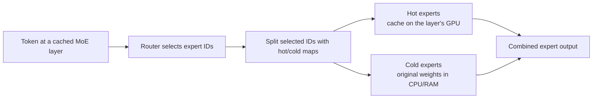

# Pascal Frankenstein LLM

A personal local-LLM inference and hardware-adaptation project for an old rig:
Intel i7-4790K with a GTX 1080 Ti (11 GB) and a GTX 1070 (8 GB).
The aim is practical, reproducible inference on dual unequal Pascal GPUs — not
 a new inference engine.

The work starts from [llama.cpp](https://github.com/ggml-org/llama.cpp) and,
for the MoE experiments, from the `perf` branch of
[thecodacus/llama.cpp](https://github.com/thecodacus/llama.cpp), initially at
commit `d927e7dc1`. This file documents what was needed to make that fork useful on
two unequal Pascal GPUs with no CUDA peer-to-peer access.

Find more info at my [second brain project](https://dinuxnode.com)

## Scope and disclosure

This repository is a record of local integration, code adaptation, measurement,
and debugging. It does **not** claim authorship of llama.cpp, GGML, the MoE
expert-cache design, or multi-GPU inference in general.

I want to thank Salvatore Sanfilippo aka `antirez` for his great passion,
`thecodacus` and all the contributors of open source community.
We are living in an amazing time, and with the help of AI I hope the world
will be a better place.

`thecodacus` created the `perf`-branch MoE work: routing traces, hot/cold
expert caching, CPU/GPU overlap, and its speculative-decoding path. The local
change described here places each hot-expert cache pack on the GPU that owns
the corresponding model layers and adds independent cache-slot counts per GPU.

The experiments, implementation, and documentation were developed with
substantial assistance from AI coding assistants. The human operator set the hardware
constraints, selected the experiments, ran and validated them, and decided
which results were retained.

## Hardware and environment

| Component | Configuration |
| --- | --- |
| Host | Intel i7-4790K (AVX2), 32 GB DDR3 |
| Environment | Native Linux Mint |
| CUDA0 | GTX 1080 Ti, 11 GB, Pascal `sm_61` |
| CUDA1 | GTX 1070, 8 GB, Pascal `sm_61` |
| CUDA / driver | CUDA Toolkit 12.9 — Pascal is not a supported target in CUDA 13 |
| GPU topology | `SYS`; CUDA P2P read/write unsupported — do not enable `GGML_CUDA_P2P` |

CUDA Graphs being disabled on Pascal is expected, not a failure.
The NVIDIA Control Panel power mode must be **Prefer maximum performance**
before drawing any performance conclusions.

## Benchmark show-off ❤️❤️❤️ 🎉🎉🎉

What I have achieved (and I am so happy):


*Real-time token generation on the Qwen3.6-35B Heretic Q4\_K\_M model at 128k context.
Full write-up: [Resurrezione GPU Pascal LLM](https://dinuxnode.com/60-69-vetrina--and--digital-garden/61.01-resurrezione-gpu-pascal-llm#show-off-performance)*


## Current operational setup

The verified daily configuration is the Heretic Qwen3.6-35B-A3B
`Native-MTP-Preserved` Q4_K_M GGUF with `-ts 10,7`, `-ncmoe 33`,
distributed cache slots, and MTP `--spec-draft-n-max 2`.

The server is started with the following command (I created a script not included in this distro):

> .local/bin/genai-llamacpp.sh

```bash
#!/usr/bin/env bash

# Exit on errors, unset variables, or failures inside pipelines.
set -euo pipefail

export LLAMA_IP=0.0.0.0
export LLAMA_PORT=8001
export LLAMA_API_KEY=changethisverylongboringkey
export install_dir="$HOME/.local/share/pascal-frankenstein-llm"
llama-server \
  --models-preset "$install_dir/config/llama-models.ini" \
  --host "$LLAMA_IP" \
  --port "$LLAMA_PORT" \
  --api-key "$LLAMA_API_KEY" \
  --models-max 1
```

The INI preset selects the model and all its parameters. Two preset sections
are defined in `config/llama-models.ini.example`:

- **`[Qwen3.6-35B-heretic]`** — text/coding, 128k context, cache `160,108`,
  Q8 K/V, MTP `n-max=2`.
- **`[Qwen3.6-35B-vision]`** — vision, 64k context, BF16 projector GPU-offloaded,
  cache `130,108` (smaller to accommodate the projector's VRAM on CUDA0).

Copy the example to create your local configuration:

```bash
install_dir="$HOME/.local/share/pascal-frankenstein-llm"
cp "$install_dir/config/llama-models.ini.example" "$install_dir/config/llama-models.ini"
${EDITOR:-vi} "$install_dir/config/llama-models.ini"
```

Replace `MODEL_PATH` and `INSTALL_DIR` with absolute paths. The INI parser
does not expand `$HOME`, `~`, or shell variables.

## Model selection rationale

The primary model — **Qwen3.6-35B-A3B** — was chosen for the following reasons:

- **VRAM budget**: the MoE architecture keeps only ~3 B parameters active per
  token. A Q4_K_M quant with the `-ncmoe 33` profile fits the combined 19 GB of
  the two Pascal cards with room for a 128k K/V cache.
- **Quality at the budget**: among models that fit this hardware, Qwen3.6-35B-A3B
  delivers the best subjective coding and reasoning quality observed during local
  testing.
- **MTP compatibility**: the Heretic `Native-MTP-Preserved` variant retains the
  draft heads needed for Multi-Token Prediction, giving a meaningful decode
  speed-up (72–73 % acceptance rate at 128k context in the validated baseline).
- **Dual-quant availability**: separate text (Heretic Q4_K_M) and vision
  (BF16 mmproj) GGUFs allow switching between text/coding and multimodal modes
  without reloading the full model weights.

This one is what I have chosen:

`Qwen3.6-35B-A3B-uncensored-heretic-Native-MTP-Preserved-Q4_K_M.gguf` 21.8 GB

And for vision capabilities:

mmproj-BF16.gguf

from [llmfan46/Qwen3.6-35B-A3B-uncensored-heretic-Native-MTP-Preserved-GGUF](https://huggingface.co/llmfan46/Qwen3.6-35B-A3B-uncensored-heretic-Native-MTP-Preserved-GGUF)


To use Vision capabilities (recognize content of uploaded images) download [Vision Projector](https://huggingface.co/llmfan46/Qwen3.6-35B-A3B-uncensored-heretic-Native-MTP-Preserved-GGUF/resolve/main/Qwen3.6-35B-A3B-uncensored-heretic-Native-MTP-Preserved-mmproj-BF16.gguf?download=true)

I renamed the file on my PC :-)

### Reasoning-loop workaround

During local use with external agents (Pi.dev), the model occasionally entered a
reasoning loop with the official chat template. A fixed Jinja template from
[froggeric/Qwen-Fixed-Chat-Templates](https://huggingface.co/froggeric/Qwen-Fixed-Chat-Templates)
resolved the issue. It is listed as a supported workaround (not the default) in
the INI example and is activated by uncommenting two lines:

```ini
chat-template-file = INSTALL_DIR/config/chat_template.jinja
reasoning-format   = deepseek
```

Old uncleaned notes and experiments log are in
[`doc/MODEL_LOCAL_GUIDE.md § Chat template override`](doc/MODEL_LOCAL_GUIDE.md#chat-template-override-workaround-for-reasoning-loops)
and [`doc/BASELINE_LOG.md`](doc/BASELINE_LOG.md).

## The local MoE cache adaptation

The upstream fork uses a routing profile to keep frequently selected ("hot")
experts in GPU memory while "cold" experts remain available in system RAM. On
this machine the original allocation chose the first GPU for every hot cache
pack. That left CUDA1 executing its layer group without the corresponding hot
experts and wasted its available VRAM.

The local change in `src/llama-model.cpp`,
`llama_model_base::init_moe_expert_cache()`, makes the cache follow the device
already selected for each layer (`dev_layer[il]`). It also accepts a separate
slot quota per device: `--moe-cache-slots 160,108` means 160 hot experts per
cached CUDA0 layer and 108 per cached CUDA1 layer. It does not change routing,
expert weights, or the cold-expert fallback.

For each cached MoE layer, the router can select a mixture of hot and cold
experts. The fork separates those expert IDs, evaluates the two paths, and
combines their outputs:


```mermaid
flowchart LR
  T["Token at a cached MoE layer"] --> R["Router selects expert IDs"]
  R --> M["Split selected IDs with hot/cold maps"]
  M --> H["Hot experts<br/>cache on the layer's GPU"]
  M --> C["Cold experts<br/>original weights in CPU/RAM"]
  H --> O["Combined expert output"]
  C --> O
```

The operational `-ncmoe 33` profile does not cache all 40 layers. Its physical
placement is:

| Device | Model-layer ownership | Expert residency |
| --- | --- | --- |
| CPU / RAM | Cold path for cached layers 0–32 | Original expert weights for layers 0–32 |
| CUDA0 · GTX 1080 Ti | Layers 0–24 | Hot cache, 160 slots per cached layer |
| CUDA1 · GTX 1070 | Layers 25–39 | Hot cache, 108 slots per layer for 25–32; all experts resident for 33–39 |

Before the local change, every hot cache pack was allocated on CUDA0, including
packs for cached layers owned by CUDA1. On a system without CUDA P2P, that
placement left CUDA1 without a local hot cache for its layer group. The local
change preserves the layer-to-device assignment and places each cache pack on
that same device.

## MoE glossary

| Term | Meaning in this project |
| --- | --- |
| **MoE** | Mixture of Experts: the router selects only a small subset of expert networks for each token. |
| **A3B** | About 3 billion active parameters per token; it does not mean the complete 35B model occupies 3B parameters of memory. |
| **Expert** | One routed feed-forward subnetwork. "Hot" and "cold" describe where that expert is served from for a given cache profile, not an intrinsic expert property. |
| **Routing profile** | A CSV produced by `llama-moe-trace` that counts routed expert IDs per layer over representative workloads. |
| **Hot-expert cache** | A GPU copy of the frequently routed experts selected by the profile. Original expert weights remain available in CPU/RAM for cold requests. |
| **`-ncmoe N`** | Keeps original experts for the first `N` MoE layers in CPU/RAM; later MoE layers keep all their experts in GPU memory. |
| **MTP** | Multi-Token Prediction: the model proposes multiple future tokens, then verifies them with the main model. It can improve decode speed only when acceptance repays its overhead. |
| **`mmproj`** | Multimodal projector: a separate GGUF vision encoder that turns an input image into embeddings the main text model can attend to. Specific to the model family it ships with; projectors are not interchangeable. |
| **`pp512` / `tg128`** | Synthetic `llama-bench` prefill of 512 tokens / generation of 128 tokens. Not equivalent to a real chat request. |
| **`r=1` / `r=3`** | One repetition is screening only; three is the normal minimum for a reported baseline. |

## Build

```bash
cd llama.cpp
cmake -S . -B build-pascal-cuda -G Ninja \
  -DGGML_CUDA=ON \
  -DCMAKE_CUDA_COMPILER=/usr/local/cuda-12.9/bin/nvcc \
  -DCMAKE_CUDA_ARCHITECTURES=61 \
  -DGGML_NATIVE=ON \
  -DLLAMA_BUILD_TESTS=OFF
cmake --build build-pascal-cuda -j 4
```

`llama-cli` and `llama-server` use comma-separated tensor splits (`-ts 10,7`).
In this fork's `llama-bench`, a slash keeps it a single configuration
(`-ts 10/7`); a comma starts two separate benchmark configurations.


## Upstream work

- [llama.cpp / GGML](https://github.com/ggml-org/llama.cpp): inference engine,
  GGUF ecosystem, kernels, and multi-GPU support.
- [thecodacus/llama.cpp](https://github.com/thecodacus/llama.cpp): `perf`
  branch — the MoE-cache baseline this fork extends.
- [antirez/ds4](https://github.com/antirez/ds4) and
  [Ninnix/q36](https://github.com/Ninnix/q36): studied as reference projects;
  not part of this build.

## License and model files

This repository does not distribute model weights. Model files remain external.
The modified llama.cpp fork retains its upstream license and attribution
requirements; publish local fork changes with the original license intact.

---
